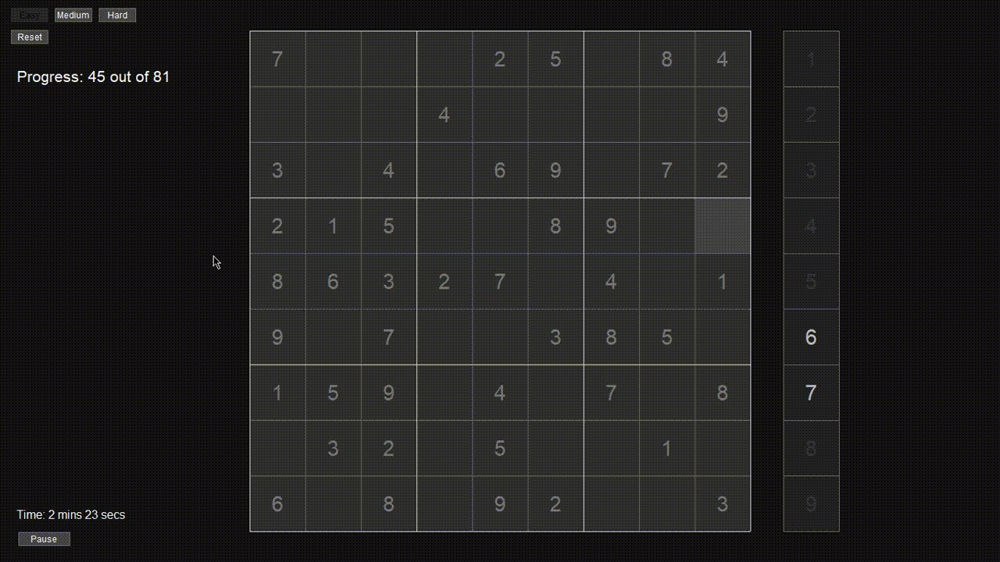

## Simple Python Sudoku App



## Installation
1. Install the [`carbon`](https://github.com/nvfp/carbon) module
2. Clone/download this repository and save it to your machine (e.g. ~/projects/Sudoku)
3. Run it:
    ```sh
    python Sudoku
    ```

## Changelog

- 1.1.0 (May 17, 2023):
    - Updated board color

## License
This project is licensed under the MIT license
